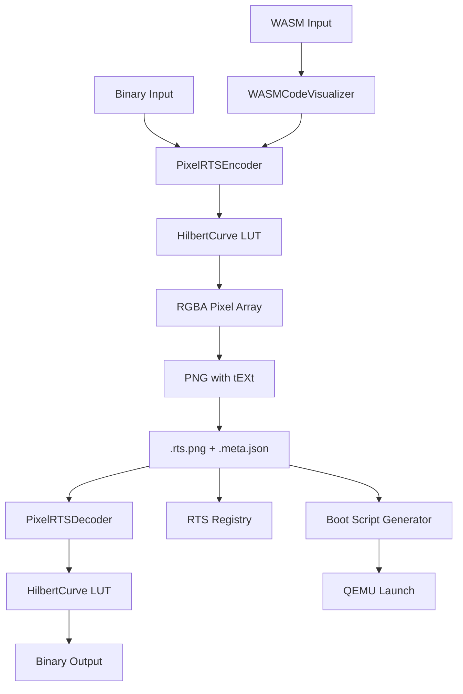

# Design: PixelRTS v2

## Overview

PixelRTS v2 encodes binary data into PNG images using RGBA dense packing with Hilbert space-filling curve mapping. Architecture follows pixel_compiler patterns: core library, CLI tools, RTS registry integration, and comprehensive testing.

## Architecture



## Components

### Component 1: HilbertCurve
**Purpose**: Generate space-filling curve LUT for locality-preserving 2D mapping

**Responsibilities**:
- Generate LUT mapping pixel index → (x, y) coordinates
- Support bidirectional index ↔ coordinate lookup
- Handle power-of-2 grid sizes (2^order)

**API**:
```python
hilbert = HilbertCurve(order=10)  # 1024×1024 grid
lut = hilbert.generate_lut()  # List of (x, y) tuples
coord = hilbert.index_to_coord(42)  # (x, y) for pixel 42
index = hilbert.coord_to_index(100, 200)  # pixel index for (100, 200)
```

### Component 2: PixelRTSEncoder
**Purpose**: Encode binary data to PNG image

**Responsibilities**:
- Calculate grid size from data length
- Apply Hilbert curve mapping
- Embed metadata in PNG tEXt chunk
- Support standard/code encoding modes

**API**:
```python
encoder = PixelRTSEncoder(mode="standard")
png_buffer = encoder.encode(data, metadata={"type": "kernel"})
```

### Component 3: PixelRTSDecoder
**Purpose**: Decode binary data from PNG image

**Responsibilities**:
- Extract metadata from PNG tEXt chunk
- Apply inverse Hilbert mapping
- Verify data integrity
- Support metadata-only inspection

**API**:
```python
decoder = PixelRTSDecoder()
data = decoder.decode(png_buffer)
metadata = decoder.get_metadata()
```

### Component 4: WASMCodeVisualizer
**Purpose**: Apply semantic coloring to WASM bytecode

**Responsibilities**:
- Detect WASM magic number (0x00 0x61 0x73 0x6d)
- Categorize opcodes (control flow, arithmetic, memory)
- Apply entropy-based coloring
- Calculate opcode entropy scores

**Color Mapping**:
- **Red**: Control flow entropy (hot = high complexity)
- **Green**: Operand 1 value
- **Blue**: Operand 2 value / immediate
- **Alpha**: Execution mask (255 = executable, 0 = data/padding)

### Component 5: Converter CLI
**Purpose**: Command-line tool for binary → PNG conversion

**Interface**:
```bash
pixelrts_v2_converter.py <input> <output.rts.png> [options]
  --mode {standard,code}    # Encoding mode
  --type <type>             # Content type (kernel, os, wasm, etc.)
  --name <name>             # Content name
  --version <version>       # Content version
  --grid-size <size>        # Explicit grid size (power of 2)
  --generate-boot-script    # Generate .boot.sh file
  --qemu-arch <arch>        # QEMU architecture (default: x86_64)
```

### Component 6: Extractor CLI
**Purpose**: Command-line tool for PNG → binary extraction

**Interface**:
```bash
pixelrts_v2_extractor.py <input.rts.png> [options]
  -o, --output <path>       # Output file (default: <input>.extracted)
  --verify                  # Verify SHA256 hash
  --info                    # Show metadata only
```

## Data Flow

### Encoding Flow
1. Read input binary data
2. Calculate grid size: `2^ceil(log2(sqrt(len(data)/4)))`
3. Generate Hilbert LUT for grid size
4. For each 4-byte chunk, map to pixel via LUT
5. Apply encoding mode (standard RGBA or code coloring)
6. Create PNG from pixel array
7. Embed metadata in tEXt chunk
8. Write `.rts.png` + `.meta.json`

### Decoding Flow
1. Load PNG image
2. Extract metadata from tEXt chunk
3. Get grid size from metadata
4. Generate Hilbert LUT
5. For each pixel in LUT order, extract RGBA bytes
6. Trim to actual data length
7. Verify SHA256 if requested
8. Write output binary

## Technical Decisions

| Decision | Options | Choice | Rationale |
|----------|---------|--------|-----------|
| Hilbert algorithm | Recursive, iterative, lookup | Lookup | O(1) access, precomputed |
| Metadata storage | tEXt only, sidecar only, both | Both | Redundancy, existing pattern |
| Grid calculation | Auto, explicit only | Auto first, explicit override | Convenience, flexibility |
| Test framework | unittest, pytest | pytest | Existing codebase standard |
| NumPy optimization | Yes, no | Yes | 10x speedup, available |

## File Structure

| File | Action | Purpose |
|------|--------|---------|
| `geometry_os/systems/pixel_compiler/pixelrts_v2_core.py` | Create | Core library (HilbertCurve, encoder/decoder) |
| `geometry_os/systems/pixel_compiler/pixelrts_v2_wasm.py` | Create | WASM code visualizer |
| `geometry_os/systems/pixel_compiler/pixelrts_v2_converter.py` | Create | Converter CLI |
| `geometry_os/systems/pixel_compiler/pixelrts_v2_extractor.py` | Create | Extractor CLI |
| `geometry_os/systems/pixel_compiler/rts_registry_manager.py` | Modify | Add PNG support |
| `geometry_os/systems/pixel_compiler/rts_boot_manager.py` | Modify | Add auto-extract |
| `geometry_os/systems/pixel_compiler/PIXELRTS_V2.md` | Create | Documentation |
| `geometry_os/systems/pixel_compiler/RTS_QUICKSTART.md` | Modify | Add v2 section |
| `geometry_os/tests/unit/test_pixelrts_v2_core.py` | Create | Core library tests |
| `geometry_os/tests/unit/test_pixelrts_v2_encoding.py` | Create | Encoding tests |
| `geometry_os/tests/unit/test_pixelrts_v2_wasm.py` | Create | WASM tests |
| `geometry_os/tests/unit/test_pixelrts_v2_performance.py` | Create | Performance tests |
| `geometry_os/tests/integration/test_pixelrts_v2_converter.py` | Create | Converter tests |
| `geometry_os/tests/integration/test_pixelrts_v2_extractor.py` | Create | Extractor tests |
| `geometry_os/tests/integration/test_pixelrts_v2_integration.py` | Create | Registry integration |
| `geometry_os/tests/integration/test_pixelrts_v2_boot_script.py` | Create | Boot script tests |
| `geometry_os/tests/integration/test_pixelrts_v2_e2e.py` | Create | E2E workflow tests |

## Error Handling

| Error | Handling | User Impact |
|-------|----------|-------------|
| Invalid PNG format | `ValueError` with descriptive message | "Invalid PixelRTS v2 container" |
| Corrupted data (hash mismatch) | Exit code 1, show expected/actual hash | Explicit error message |
| Non-power-of-2 grid | Auto-calculate to next power-of-2 | Warning message |
| Missing metadata | Use basic structure from image | Graceful degradation |
| WASM detection failure | Fall back to standard mode | Warning message |

## Existing Patterns to Follow

### RTS Registry Integration
- File: `geometry_os/systems/pixel_compiler/rts_registry_manager.py`
- Pattern: `register()` method with metadata dict, SHA256 checksum
- Extension: Add `_register_pixelrts_v2()` method for PNG detection

### Boot Manager Integration
- File: `geometry_os/systems/pixel_compiler/rts_boot_manager.py`
- Pattern: `boot_cartridge()` method with unpacking logic
- Extension: Add `.rts.png` detection and auto-extraction

### Test Pattern
- File: `geometry_os/tests/unit/test_sse_parser.py`
- Pattern: pytest with descriptive test names, `assert` statements
- Follow: `test_<component>_<behavior>()` naming

### CLI Pattern
- File: `geometry_os/systems/pixel_compiler/rts_registry_manager.py`
- Pattern: argparse with subcommands, epilog examples
- Follow: `parser.add_argument()` with help, choices, defaults

## Performance Considerations

### Encoding Optimization
- **Baseline**: Pixel-by-pixel Python loop
- **Optimized**: NumPy vectorized assignment
- **Trade-off**: Code mode requires pixel-by-pixel for semantic coloring

### Memory Usage
- Grid size limited to 8192×8192 (256 MB RGB array ~1GB RAM)
- Use `numpy.uint8` for minimal memory footprint
- Consider progressive loading for future enhancement

## Security Considerations

- SHA256 verification prevents tampering
- Path traversal protection in CLI tools
- Input validation for grid sizes (power-of-2 check)
- WASM parsing is read-only, no execution risk
