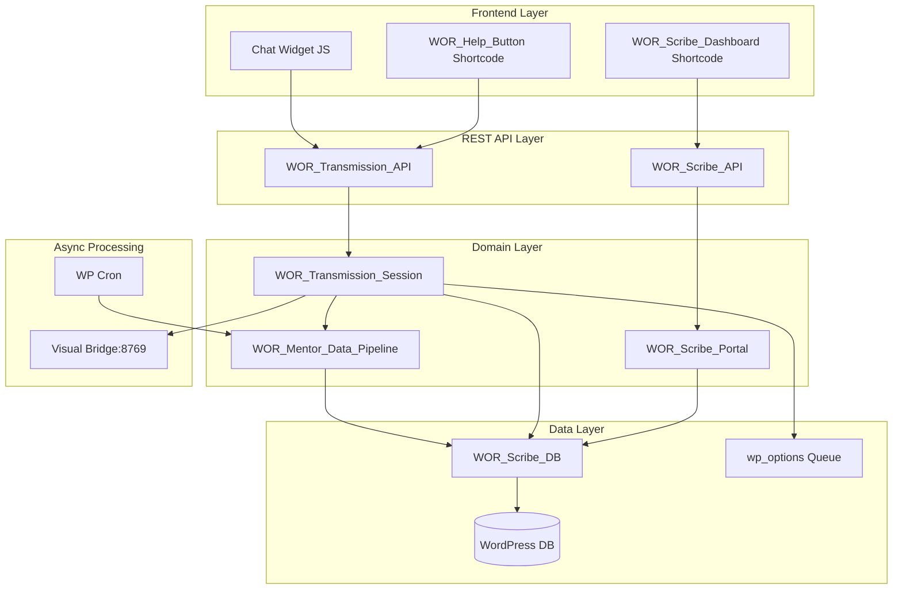
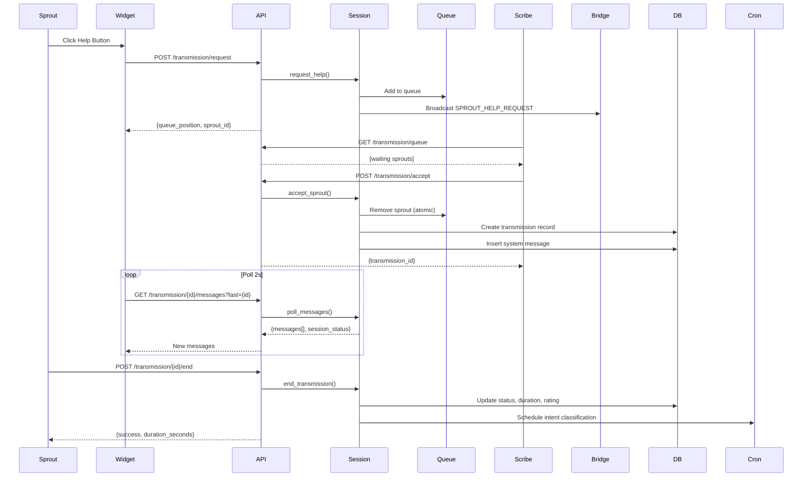

# Design: Scribe Protocol

## Overview
Expert-in-the-loop mentorship system extending World of Rectification plugin. Backend implementation ~90% complete. Design focuses on completing frontend UI (shortcodes, chat widget), adding missing cron handlers, and ensuring singleton pattern consistency.

## Architecture



## Current Implementation Status

| Component | Status | File | Notes |
|-----------|--------|------|-------|
| WOR_Scribe_DB | COMPLETE | includes/class-scribe-db.php | 5 tables created on activation |
| WOR_Scribe_Portal | COMPLETE | includes/class-scribe-portal.php | Registration, onboarding flows |
| WOR_Transmission_Session | COMPLETE | includes/class-transmission-session.php | Queue, messaging, session mgmt |
| WOR_Mentor_Data_Pipeline | COMPLETE | includes/class-mentor-data-pipeline.php | Intent classification, export |
| WOR_Scribe_API | NEEDS FIX | api/class-scribe-api.php | Missing singleton pattern |
| Scribe Dashboard Shortcode | MISSING | - | US-9 |
| Help Button Shortcode | MISSING | - | US-10 |
| Chat Widget JS | MISSING | - | US-5, US-10 |
| Cron Handlers | MISSING | - | US-7 intent classification |
| Stale Session Cleanup | MISSING | - | FR-11 |

## Data Flow: Transmission Session



## Database Schema

### Tables (Already Created)

```sql
-- wp_wor_scribes
CREATE TABLE wp_wor_scribes (
    id BIGINT AUTO_INCREMENT PRIMARY KEY,
    user_id BIGINT NOT NULL UNIQUE,
    cohort ENUM('internal','community','domain_expert') DEFAULT 'community',
    expertise_tags JSON,
    onboarding_completed TINYINT(1) DEFAULT 0,
    onboarding_step INT DEFAULT 0,
    mentorship_count INT DEFAULT 0,
    avg_sprout_rating DECIMAL(3,2),
    ghost_training_eligible TINYINT(1) DEFAULT 0,
    created_at DATETIME DEFAULT CURRENT_TIMESTAMP
);

-- wp_wor_sprouts
CREATE TABLE wp_wor_sprouts (
    id BIGINT AUTO_INCREMENT PRIMARY KEY,
    user_id BIGINT NOT NULL UNIQUE,
    primary_sefirah VARCHAR(50),
    current_quest_id BIGINT,
    assigned_scribe_id BIGINT,
    total_sessions INT DEFAULT 0,
    created_at DATETIME DEFAULT CURRENT_TIMESTAMP,
    KEY (assigned_scribe_id)
);

-- wp_wor_transmissions
CREATE TABLE wp_wor_transmissions (
    id BIGINT AUTO_INCREMENT PRIMARY KEY,
    scribe_id BIGINT NOT NULL,
    sprout_id BIGINT NOT NULL,
    quest_context_id BIGINT,
    status ENUM('active','completed','abandoned') DEFAULT 'active',
    started_at DATETIME DEFAULT CURRENT_TIMESTAMP,
    ended_at DATETIME,
    duration_seconds INT,
    scribe_rating INT,
    sprout_feedback TEXT,
    KEY (scribe_id),
    KEY (sprout_id),
    KEY (status)
);

-- wp_wor_transmission_messages
CREATE TABLE wp_wor_transmission_messages (
    id BIGINT AUTO_INCREMENT PRIMARY KEY,
    transmission_id BIGINT NOT NULL,
    sender_type ENUM('scribe','sprout','system') NOT NULL,
    sender_id BIGINT NOT NULL,
    message_text TEXT NOT NULL,
    intent_label VARCHAR(100),
    created_at DATETIME DEFAULT CURRENT_TIMESTAMP,
    KEY (transmission_id)
);

-- wp_wor_intent_clusters
CREATE TABLE wp_wor_intent_clusters (
    id BIGINT AUTO_INCREMENT PRIMARY KEY,
    intent_name VARCHAR(100) NOT NULL UNIQUE,
    description TEXT,
    sample_phrases JSON,
    message_count INT DEFAULT 0,
    accuracy_score DECIMAL(4,3),
    created_at DATETIME DEFAULT CURRENT_TIMESTAMP
);
```

## Technical Decisions

| Decision | Options | Choice | Rationale |
|----------|---------|--------|-----------|
| Chat transport | WebSocket, Polling | Polling (2s) | MVP simplicity, no server infra change |
| Queue storage | Redis, wp_options, custom table | wp_options | Low traffic MVP, simple implementation |
| Intent classification | ML API, Regex patterns | Regex patterns | Zero latency, no external deps |
| API class pattern | Direct instantiation, Singleton | Singleton | Consistent with WOR_Quest_API pattern |
| Frontend framework | Vue, React, jQuery | jQuery | Matches existing wor-game.js pattern |
| Session timeout | Client-side, Server cron | Server cron (hourly) | Reliable cleanup, no client deps |

## Component Interfaces

### WOR_Scribe_API (Fix Required)

```php
class WOR_Scribe_API {
    private static ?WOR_Scribe_API $instance = null;

    public static function get_instance(): self;
    private function __construct(); // Add singleton

    // Existing endpoints (complete)
    public function register_routes(): void;
    public function api_scribe_register(WP_REST_Request): WP_REST_Response;
    public function api_scribe_onboarding(WP_REST_Request): WP_REST_Response;
    public function api_scribe_complete_step(WP_REST_Request): WP_REST_Response;
    public function api_transmission_request(WP_REST_Request): WP_REST_Response;
    public function api_transmission_queue(WP_REST_Request): WP_REST_Response;
    public function api_transmission_accept(WP_REST_Request): WP_REST_Response;
    public function api_transmission_poll(WP_REST_Request): WP_REST_Response;
    public function api_transmission_send(WP_REST_Request): WP_REST_Response;
    public function api_transmission_end(WP_REST_Request): WP_REST_Response;
    public function api_training_stats(WP_REST_Request): WP_REST_Response;
}
```

### WOR_Scribe_Dashboard (NEW)

```php
class WOR_Scribe_Dashboard {
    private static ?WOR_Scribe_Dashboard $instance = null;

    public static function get_instance(): self;
    private function __construct();

    public function register_shortcode(): void;
    public function render_dashboard(): string;
    public function render_registration_form(): string;
    public function render_onboarding_progress(array $scribe): string;
    public function render_sprout_queue(): string;
    public function render_session_history(int $user_id): string;

    // AJAX handlers
    public function ajax_refresh_queue(): void;
}
```

### WOR_Help_Button (NEW)

```php
class WOR_Help_Button {
    private static ?WOR_Help_Button $instance = null;

    public static function get_instance(): self;
    private function __construct();

    public function register_shortcode(): void;
    public function render_button(int $quest_id): string;
    public function enqueue_chat_widget(): void;
}
```

### Chat Widget JavaScript (NEW)

```javascript
// assets/js/wor-chat-widget.js
window.WoRChatWidget = {
    init(options: {
        transmissionId?: number,
        sproutId?: number,
        questId?: number,
        restUrl: string,
        nonce: string
    }): void,

    requestHelp(questId: number, topic?: string): Promise<{queue_position, sprout_id}>,
    pollMessages(lastId: number): Promise<{messages[], session_status, last_id}>,
    sendMessage(message: string, senderType: string): Promise<{message_id, timestamp}>,
    endSession(rating: number, feedback?: string): Promise<{success, duration_seconds}>,
    renderWaitingState(queuePosition: number): void,
    renderChatState(transmissionId: number): void,
    renderRatingForm(): void
};
```

## File Structure

| File | Action | Purpose |
|------|--------|---------|
| includes/class-scribe-shortcodes.php | CREATE | Dashboard + Help Button shortcodes |
| assets/js/wor-chat-widget.js | CREATE | Chat widget with polling |
| assets/css/wor-chat.css | CREATE | Chat widget styles |
| api/class-scribe-api.php | MODIFY | Add singleton pattern |
| world-of-rectification.php | MODIFY | Register shortcodes, cron handlers |

## Error Handling

| Error Scenario | HTTP Code | Response | User Impact |
|----------------|-----------|----------|-------------|
| Unauthenticated | 401 | `{error: "You must be logged in"}` | Redirect to login |
| Already registered | 400 | `{error: "Already registered"}` | Show dashboard |
| Onboarding incomplete | 403 | `{error: "Onboarding not completed"}` | Block queue access |
| Session not active | 400 | `{error: "Session not active"}` | Show reconnection UI |
| Sprout already claimed | 409 | `{error: "Sprout no longer waiting"}` | Refresh queue |
| Empty message | 400 | `{error: "Message cannot be empty"}` | Validation UI |
| Quiz failed | 200 | `{error: "Quiz not passed", score, passing_score}` | Show retry UI |
| Visual Bridge down | 200 | Success (broadcast fails silently) | Queue still works |

## Edge Cases

- **Race condition on accept**: Use `$wpdb->query()` with WHERE clause, check `affected_rows`. If 0, Sprout was claimed.
- **Stale queue entries**: Hourly cron removes entries >1 hour old from `wor_sprout_queue` option.
- **Stale sessions**: Hourly cron marks sessions as `abandoned` if `started_at` >30 min ago and status=`active`.
- **Network disconnect**: Widget shows "Reconnecting..." and retries poll every 5s until success.
- **Multiple tabs**: Each tab maintains own `last_message_id`, no conflict.
- **Re-registration attempt**: Return existing scribe_id, don't error (idempotent).

## Test Strategy

### Unit Tests (PHPUnit)
- `WOR_Scribe_Portal::register_scribe()` - duplicate check, valid cohort
- `WOR_Scribe_Portal::complete_step()` - quiz grading, step advancement
- `WOR_Transmission_Session::request_help()` - queue addition, duplicate session
- `WOR_Transmission_Session::accept_sprout()` - race condition simulation
- `WOR_Transmission_Session::send_message()` - empty message, inactive session
- `WOR_Mentor_Data_Pipeline::classify_intent()` - pattern matching accuracy
- `WOR_Mentor_Data_Pipeline::export_transmission()` - format validation

### Integration Tests
- Full transmission flow: request → accept → message → end
- Onboarding completion sets `ghost_training_eligible`
- Rating updates `mentorship_count` and `avg_sprout_rating`
- Cron tasks execute and clean up properly

### E2E Tests (Manual)
1. Register as Scribe (community cohort)
2. Complete onboarding steps
3. Pass certification quiz
4. View dashboard with queue
5. As Sprout, click help button
6. As Scribe, accept from queue
7. Exchange messages
8. End session with rating
9. View session history

### API Tests (curl)
```bash
# Register
curl -X POST http://localhost/wp-json/wor/v1/scribe/register \
  -H "Cookie: $(cat wp_cookie)" \
  -d "cohort=community"

# Request help
curl -X POST http://localhost/wp-json/wor/v1/transmission/request \
  -H "Cookie: $(cat wp_cookie)" \
  -d "quest_id=123&topic=stuck"

# Get queue
curl http://localhost/wp-json/wor/v1/transmission/queue \
  -H "Cookie: $(cat wp_cookie)"

# Accept
curl -X POST http://localhost/wp-json/wor/v1/transmission/accept \
  -H "Cookie: $(cat wp_cookie)" \
  -d "sprout_id=1"

# Send message
curl -X POST http://localhost/wp-json/wor/v1/transmission/1/send \
  -H "Cookie: $(cat wp_cookie)" \
  -d "message=Hello&sender_type=scribe"

# Poll
curl "http://localhost/wp-json/wor/v1/transmission/1/messages?last=0" \
  -H "Cookie: $(cat wp_cookie)"

# End
curl -X POST http://localhost/wp-json/wor/v1/transmission/1/end \
  -H "Cookie: $(cat wp_cookie)" \
  -d "rating=5&feedback=Great help!"
```

## Performance Considerations

- Polling interval: 2s (configurable via localized script)
- Max messages per poll: 100 (add LIMIT to query)
- Queue stored in single option: O(n) scan, acceptable for <100 waiting
- Intent classification: 5s delay via wp_schedule_single_event (async)
- Visual Bridge: 2s timeout, non-blocking

## Security Considerations

- All endpoints require `is_user_logged_in()` check
- Training stats requires `manage_options` capability
- Messages sanitized with `sanitize_textarea_field()`
- Nonce verification on all POST requests
- Rate limiting: Consider adding per-user request throttling

## Existing Patterns to Follow

From codebase analysis:
1. **Singleton pattern**: `private static $instance`, `get_instance()`, private constructor
2. **Naming**: `WOR_ClassName` (uppercase prefix)
3. **REST registration**: `add_action('rest_api_init', [$this, 'register_routes'])`
4. **Helper function**: `function WOR_ClassName(): ClassName { return ClassName::get_instance(); }`
5. **jQuery pattern**: IIFE with `$` parameter, `$(document).ready()`
6. **Script localization**: `wp_localize_script()` with `restUrl`, `nonce`, `isLoggedIn`
7. **Activation hook**: Tables created via `register_activation_hook()` + `dbDelta()`

## Unresolved Questions

1. **Rating threshold**: Requirements say 3.5/5 - should this be configurable via admin settings?
2. **Export format**: JSON with `{metadata, messages[]}` - add JSONL option for OpenAI fine-tuning?
3. **Scribe revocation**: If rating drops, auto-revoke certification? Manual admin action?
4. **Cross-session history**: Should Sprout see previous sessions with same Scribe?

## Implementation Steps

1. **Fix WOR_Scribe_API singleton** - Add `get_instance()`, private constructor, helper function
2. **Create class-scribe-shortcodes.php** - Dashboard + Help Button shortcodes with singleton
3. **Create wor-chat-widget.js** - jQuery IIFE with polling, message send, rating form
4. **Create wor-chat.css** - Modal styles, chat bubble layout, responsive mobile
5. **Update world-of-rectification.php** - require_once shortcodes, init on plugins_loaded
6. **Add cron handlers** - `wor_classify_message_intent`, `wor_cleanup_stale_sessions`, `wor_expire_queue_entries`
7. **Add admin settings** (optional) - Rating threshold, queue timeout config
8. **Manual testing** - Full flow walkthrough per E2E test plan
9. **Write unit tests** - Core methods in each class
10. **Documentation** - Update plugin README with shortcode usage
