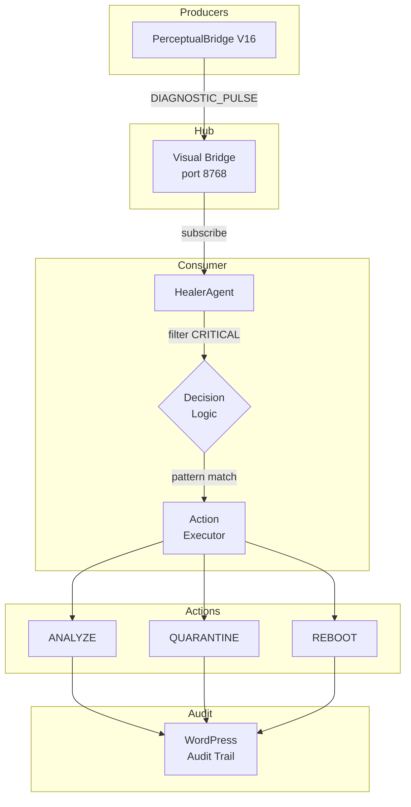

# Design: self-healing-ui

## Overview

HealerAgent is an autonomous agent that subscribes to Visual Bridge WebSocket, processes DIAGNOSTIC_PULSE events, and executes healing actions (ANALYZE, QUARANTINE, REBOOT) based on pattern matching. All actions are logged to WordPress for audit trail.

## Architecture



## Components

### HealerAgent

**Purpose**: Main agent class that consumes events and orchestrates healing.

**Responsibilities**:
- Maintain WebSocket connection to Visual Bridge
- Filter DIAGNOSTIC_PULSE events by status
- Execute decision logic for CRITICAL events
- Track healing history
- Publish audit entries to WordPress

**Configuration**:
| Parameter | Type | Default | Description |
|-----------|------|---------|-------------|
| `ws_url` | str | `ws://localhost:8768` | Visual Bridge URL |
| `reaction_threshold` | float | 1.0 | Max seconds to react |
| `auto_reboot` | bool | False | Allow automatic reboots |

### HealingAction (Enum)

**Purpose**: Define available healing actions.

```python
class HealingAction(Enum):
    ANALYZE = "analyze"      # Capture state, log, no immediate action
    QUARANTINE = "quarantine" # Isolate district from others
    REBOOT = "reboot"        # Trigger substrate restart
```

### HealingResult (Dataclass)

**Purpose**: Structure for healing action results.

| Field | Type | Description |
|-------|------|-------------|
| `action` | HealingAction | Action taken |
| `district_id` | str | Target district |
| `reason` | str | Why this action |
| `timestamp` | float | When action occurred |
| `success` | bool | Whether action succeeded |
| `details` | Dict | Additional metadata |

## Data Flow

1. **Event Reception**: HealerAgent receives DIAGNOSTIC_PULSE from WebSocket
2. **Status Filter**: HEALTHY ignored, WARNING analyzed, CRITICAL processed
3. **Pattern Match**: Decision logic matches pattern to action
4. **Action Execution**: Executor performs action (analyze/quarantine/reboot)
5. **Audit Publishing**: Result published to WordPress
6. **History Tracking**: Result appended to in-memory history

## Technical Decisions

| Decision | Options | Choice | Rationale |
|----------|---------|--------|-----------|
| WebSocket library | `websockets`, `aiohttp`, `websocket-client` | `websockets` | Already used in PerceptualBridge |
| Reconnection strategy | Fixed interval, exponential backoff | Exponential backoff | Prevent connection storms |
| History storage | In-memory, file, database | In-memory list | Simple, sufficient for debugging |
| Action timeout | None, 1s, 5s | 5s for WordPress | Balance responsiveness and reliability |

## File Structure

| File | Action | Purpose |
|------|--------|---------|
| `systems/visual_shell/swarm/healer_agent.py` | Create | HealerAgent implementation |
| `tests/system/test_healer_agent.py` | Create | Unit tests |
| `tests/system/test_healer_integration.py` | Create | Integration tests |
| `docs/healer_agent.md` | Create | User documentation |

## Decision Logic

### Pattern-to-Action Mapping

```python
def decide_action(pattern: str, detected_text: str, auto_reboot: bool) -> HealingAction:
    pattern_lower = pattern.lower()

    if "panic" in pattern_lower or "not syncing" in pattern_lower:
        return HealingAction.QUARANTINE

    if "segfault" in pattern_lower or "segmentation" in pattern_lower:
        return HealingAction.ANALYZE

    if "frozen" in pattern_lower or "freeze" in detected_text.lower():
        return HealingAction.REBOOT if auto_reboot else HealingAction.QUARANTINE

    # Safe default for unknown patterns
    return HealingAction.QUARANTINE
```

### Status Handling

| Status | Action | Returns |
|--------|--------|---------|
| HEALTHY | None | `None` (no action) |
| WARNING | ANALYZE | `HealingResult` with ANALYZE |
| CRITICAL | Decision logic | `HealingResult` per pattern |

## Error Handling

| Error | Handling | User Impact |
|-------|----------|-------------|
| WebSocket disconnect | Reconnect with backoff | Actions delayed, not lost |
| WordPress timeout | Log warning, continue | Audit entry missing |
| Invalid JSON | Log warning, skip message | Single event skipped |
| Unknown exception | Log error, continue | Agent stays running |

```python
# Error handling pattern
try:
    data = json.loads(message)
except json.JSONDecodeError:
    logger.warning(f"Invalid JSON: {message[:100]}")
    return  # Skip this message
```

## Existing Patterns to Follow

| Pattern | Source File | Lines |
|---------|-------------|-------|
| WebSocket client with reconnect | `perceptual_bridge.py` | 157-177 |
| Event filtering | `visual_bridge.py` | 207-234 |
| WordPress publishing | `publish_to_wp.py` | 30-52 |
| Dataclass result structure | `perceptual_bridge.py` | 31-38 |
| Enum for status/action | `perceptual_bridge.py` | 24-28 |

## Performance Considerations

### Reaction Time Budget

| Operation | Budget | Notes |
|-----------|--------|-------|
| Event parsing | 1ms | JSON decode |
| Pattern matching | 5ms | Regex on short strings |
| Action decision | 1ms | Simple string matching |
| WordPress publish | 500ms | Async, non-blocking |
| **Total** | **~507ms** | Under 1s threshold |

### Memory Management

- Healing history limited to 100 entries (configurable)
- Detected text truncated to 200 chars before storage
- No persistent state (restart resets history)

## Testing Strategy

| Test Level | Coverage | Tools |
|------------|----------|-------|
| Unit | Decision logic, action execution | pytest, AsyncMock |
| Integration | Full flow with mock WordPress | pytest, patch |
| E2E | WebSocket subscription | pytest-asyncio |

### Mock Patterns

```python
# Mock WordPress in tests
with patch.object(agent, '_publish_to_wordpress', new_callable=AsyncMock) as mock_wp:
    mock_wp.return_value = True
    result = await agent._handle_diagnostic_pulse(pulse)
    mock_wp.assert_called_once()
```

## Security Considerations

1. **No authentication** on Visual Bridge (internal network assumption)
2. **auto_reboot=False** prevents accidental data loss
3. **WordPress audit** provides tamper-evident log
4. **No command injection** - actions are enum values, not strings
