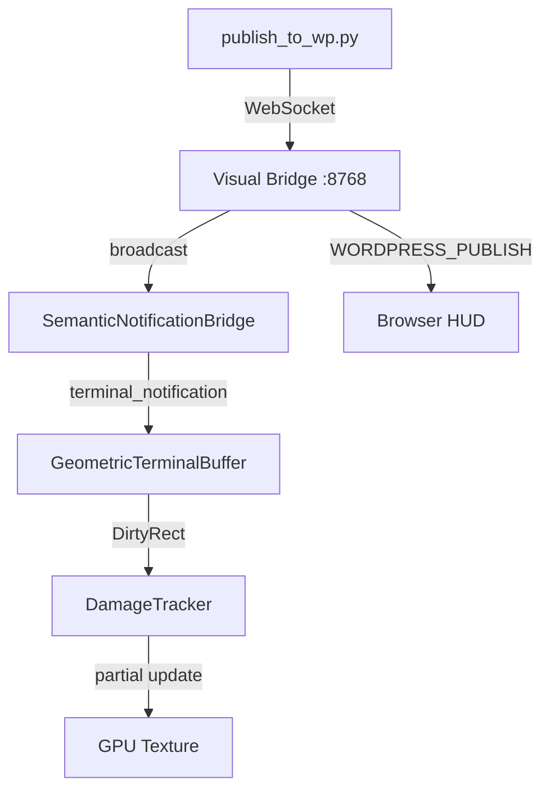

# Design: semantic-geometric-terminal

## Overview

Bridge WordPress publish events to PixelRTS v3 geometric terminal via Visual Bridge WebSocket hub. Uses SemanticNotificationBridge for formatting and GeometricTerminalBuffer for rendering with DamageTracker for efficient GPU updates.

## Architecture

## Components

### SemanticNotificationBridge (Python)

**Purpose**: Format WordPress events for terminal display
**File**: `systems/visual_shell/api/semantic_notification_bridge.py`
**Responsibilities**:
- Convert title/content to 80-char terminal line
- Strip HTML tags from content
- Auto-assign color from title keywords
- Format: `[HH:MM:SS] Title - Content`

### GeometricTerminalBuffer.write_notification (Rust)

**Purpose**: Write formatted notification to terminal buffer
**File**: `systems/infinite_map_rs/src/terminal_clone/geometric_bridge.rs`
**Responsibilities**:
- Write timestamp prefix in dim gray (color 8)
- Write message in specified color with bold flag
- Advance cursor to next line
- Return DirtyRect for damage tracking

### DamageTracker Integration

**Purpose**: Track changed cells for efficient GPU updates
**File**: `systems/infinite_map_rs/src/damage_tracker.rs`
**Responsibilities**:
- Compute DirtyRect from notification position
- Merge adjacent rectangles
- Map to Hilbert curve for texture locality

## Data Flow

1. AI agent calls `publish_to_wordpress(title, content)`
2. `publish_to_wp.py` sends `wordpress_publish` via WebSocket
3. Visual Bridge receives, creates `NotificationEvent`
4. SemanticNotificationBridge formats for terminal
5. Visual Bridge broadcasts `terminal_notification` opcode
6. Rust app receives, calls `write_notification_tracked`
7. DirtyRect returned, GPU updated efficiently

## Technical Decisions

| Decision | Options | Choice | Rationale |
|----------|---------|--------|-----------|
| Color mapping | Hardcoded, config file, ML | Hardcoded keywords | Simple, deterministic |
| Width limit | 80, 120, dynamic | 80 fixed | Standard terminal |
| Timestamp format | ISO, HH:MM:SS, relative | HH:MM:SS | Compact, readable |
| HTML handling | Strip, escape, render | Strip with regex | Terminal is text-only |

## File Structure

| File | Action | Purpose |
|------|--------|---------|
| `systems/visual_shell/api/semantic_notification_bridge.py` | Create | Python bridge class |
| `systems/infinite_map_rs/src/terminal_clone/geometric_bridge.rs` | Modify | Add notification methods |
| `systems/visual_shell/api/visual_bridge.py` | Modify | Wire semantic bridge |
| `tests/test_semantic_notification_bridge.py` | Create | Unit tests |
| `tests/test_semantic_terminal_e2e.py` | Create | E2E integration test |

## Error Handling

| Error | Handling | User Impact |
|-------|----------|-------------|
| Visual Bridge down | Log warning, continue | No terminal notification |
| Content too long | Truncate with ellipsis | Partial message shown |
| Invalid color index | Default to bright blue | Wrong color, readable |
| Timestamp fail | Use "00:00:00" fallback | Timestamp shows but wrong |

## Existing Patterns to Follow

- `visual_bridge.py:308-317` - wordpress_publish handler pattern
- `geometric_bridge.rs:117-129` - putc cursor advance pattern
- `damage_tracker.rs:139-145` - mark_rect_dirty pattern
- `publish_to_wp.py:13-28` - WebSocket send pattern
