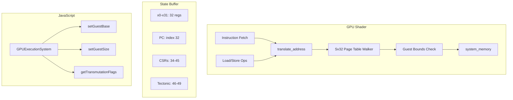

# Design: spatial-mmu

## Overview

Harden the existing Spatial MMU in `visual_cpu_riscv.wgsl` by verifying 64-register state, adding instruction fetch MMU translation (security critical), and extending GPUExecutionSystem with Tectonic register accessors.

## Architecture



## Components

### Component A: Instruction Fetch MMU Translation

**Purpose**: Security-critical fix for instruction fetch bypass
**Location**: `visual_cpu_riscv.wgsl` line 360
**Responsibilities**:
- Translate PC through MMU before fetching instruction
- Use ACCESS_EXEC permission check
- Trigger instruction page fault on permission failure

**Current Code**:
```wgsl
let inst = expanded_code[pc];  // SECURITY GAP
```

**Fixed Code**:
```wgsl
let paddr = translate_address(pc * 4u, ACCESS_EXEC, base_idx);
if (paddr == 0xFFFFFFFFu) {
    pc = trap_enter(base_idx, CAUSE_INST_PAGE_FAULT, pc * 4u, pc);
    cpu_states[base_idx + 32u] = pc;
    return;
}
let inst = expanded_code[paddr / 4u];
```

### Component B: Morton Encoding Functions

**Purpose**: Texture cache locality optimization
**Location**: `visual_cpu_riscv.wgsl` lines 213-228
**Responsibilities**:
- Convert linear addresses to Z-curve coordinates
- Preserve spatial locality for texture cache

**Existing Functions** (verify presence):
- `part1by1(n)` - interleave bits
- `morton_encode(x, y)` - 2D to 1D
- `morton_decode(m)` - 1D to 2D
- `phys_to_morton(paddr)` - address to Morton index

### Component C: Guest Bounds Checking

**Purpose**: Spatial isolation between guests
**Location**: `visual_cpu_riscv.wgsl` lines 289-294
**Responsibilities**:
- Check physical address against GUEST_BASE/SIZE
- Return 0xFFFFFFFF on violation (triggers page fault)

**Existing Implementation**:
```wgsl
let g_base = cpu_states[base_idx + CSR_GUEST_BASE];
let g_size = cpu_states[base_idx + CSR_GUEST_SIZE];
if (g_size > 0u) {
    if (paddr < g_base || paddr >= (g_base + g_size)) {
        return 0xFFFFFFFFu;
    }
}
```

### Component D: Dirty/Access Bit Tracking

**Purpose**: Transmutation cache invalidation triggers
**Location**: `visual_cpu_riscv.wgsl` translate_address function
**Responsibilities**:
- Set A bit (0x40) on first access
- Set D bit (0x80) on write
- Signal cache invalidation for executable pages

**Existing Implementation** (verify in both megapage and leaf paths):
```wgsl
pte1 = pte1 | 0x40u; // A=1
if (access_type == ACCESS_WRITE) { pte1 = pte1 | 0x80u; } // D=1
system_memory[pte1_addr / 4u] = pte1;
```

### Component E: JavaScript Register Accessors

**Purpose**: Programmatic control of Tectonic registers
**Location**: `gpu_execution_system.js`
**Responsibilities**:
- setGuestBase(kernelId, base) - write to CSR 46
- setGuestSize(kernelId, size) - write to CSR 47
- setGeometryCacheBase(kernelId, base) - write to CSR 48
- getTransmutationFlags(kernelId) - read from CSR 49

## Data Flow

1. **Instruction Fetch Flow** (SECURITY FIX):
   - Read PC from cpu_states[base_idx + 32]
   - Call translate_address(pc * 4, ACCESS_EXEC, base_idx)
   - If 0xFFFFFFFF: trap_enter with CAUSE_INST_PAGE_FAULT
   - Else: fetch instruction from translated address

2. **Load/Store Flow** (existing):
   - Calculate virtual address
   - Call translate_address(vaddr, ACCESS_READ/WRITE, base_idx)
   - Bounds check applied in translate_address
   - A/D bits set appropriately

3. **Tectonic Configuration Flow**:
   - JavaScript calls setGuestBase/setGuestSize
   - device.queue.writeBuffer to state buffer at offset 46*4 or 47*4
   - Shader reads from cpu_states[base_idx + CSR_GUEST_*]

## Technical Decisions

| Decision | Options | Choice | Rationale |
|----------|---------|--------|-----------|
| PC as virtual address | Direct/Translated | Translated | Security: prevents code injection |
| Morton implementation | Hilbert/Morton | Morton | Faster in WGSL, good locality |
| Bounds check location | Before/After PTW | After | Physical addresses for bounds |
| A/D bit update | Immediate/Lazy | Immediate | Simpler, triggers transmutation |

## File Structure

| File | Action | Purpose |
|------|--------|---------|
| `systems/visual_shell/web/shaders/visual_cpu_riscv.wgsl` | Verify | Confirm 64 regs, Morton, bounds |
| `systems/visual_shell/web/shaders/visual_cpu_riscv.wgsl:360` | Modify | Add MMU translation to fetch |
| `systems/visual_shell/web/gpu_execution_system.js` | Verify | Confirm accessor methods |
| `systems/visual_shell/web/test_tectonic_mmu.html` | Extend | Add instruction fetch tests |

## Error Handling

| Error | Handling | User Impact |
|-------|----------|-------------|
| Instruction page fault | trap_enter(CAUSE_INST_PAGE_FAULT) | Guest OS handles via STVEC |
| Out-of-bounds access | translate_address returns 0xFFFFFFFF | Page fault, guest isolated |
| MMU disabled (bare mode) | Direct physical access, bounds still checked | Legacy compatibility |

## Existing Patterns to Follow

- Sv32 walker pattern: lines 231-297 in visual_cpu_riscv.wgsl
- Trap handling pattern: trap_enter/trap_ret functions
- CSR accessor pattern: _get_csr_index() function
- Buffer write pattern: device.queue.writeBuffer in GPUExecutionSystem

## Verification Commands

```bash
# Check shader has 64 registers
grep "REGS_PER_CORE.*64" systems/visual_shell/web/shaders/visual_cpu_riscv.wgsl

# Check Morton encoding exists
grep "phys_to_morton" systems/visual_shell/web/shaders/visual_cpu_riscv.wgsl

# Check bounds checking exists
grep "CSR_GUEST_BASE" systems/visual_shell/web/shaders/visual_cpu_riscv.wgsl

# Check JS accessors exist
grep "setGuestBase" systems/visual_shell/web/gpu_execution_system.js
```
