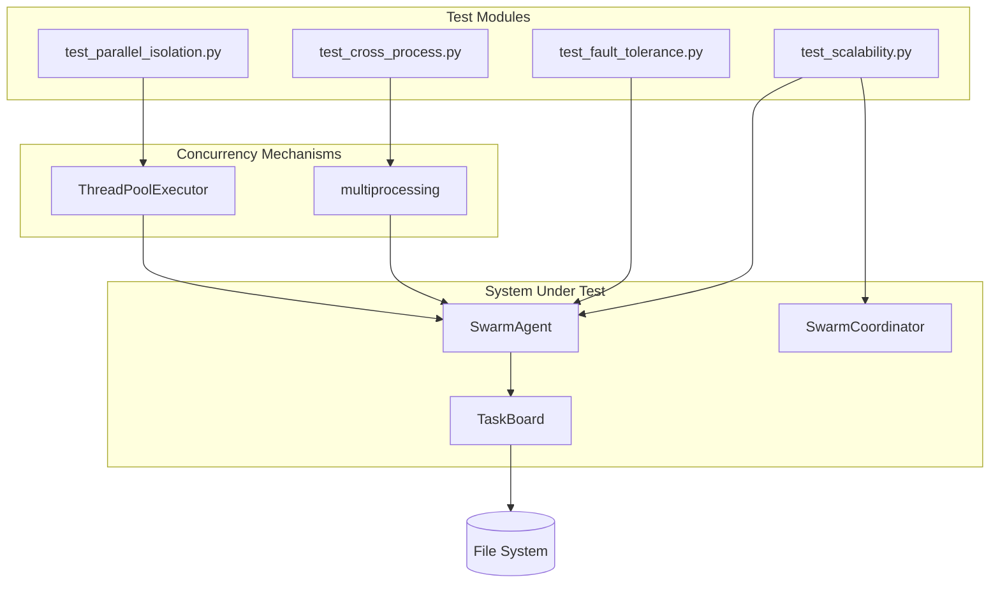

# Design: Swarm Intelligence Proofs

## Overview

4 new test modules extending existing test suite. Each module proves a specific aspect: parallel isolation (threading), cross-process (subprocess), fault tolerance (error injection), scalability (load testing).

## Architecture



## Components

### test_parallel_isolation.py
**Purpose**: Prove in-memory concurrent operations don't race
**Responsibilities**:
- Thread-based concurrent claiming
- Result attribution verification
- File lock stress testing

### test_cross_process.py
**Purpose**: Prove true process isolation with shared storage
**Responsibilities**:
- Subprocess spawning via `subprocess.Popen`
- Isolated environment verification
- Multi-worker coordination

### test_fault_tolerance.py
**Purpose**: Prove graceful handling of failures
**Responsibilities**:
- Stale claim simulation (timestamp manipulation)
- Corruption injection (invalid JSON)
- Failure path testing

### test_scalability.py
**Purpose**: Prove performance at scale
**Responsibilities**:
- 100/1000 task distribution
- Latency measurement
- Memory profiling with `tracemalloc`

## Data Flow

1. **Parallel Isolation**: Create tasks -> Spawn threads -> Concurrent claim -> Verify uniqueness
2. **Cross-Process**: Create tasks -> Spawn subprocesses -> Each claims via TaskBoard -> Wait for completion
3. **Fault Tolerance**: Create task -> Corrupt state -> Verify graceful handling
4. **Scalability**: Create N tasks -> Measure claim latency / memory -> Assert bounds

## Technical Decisions

| Decision | Options | Choice | Rationale |
|----------|---------|--------|-----------|
| Concurrency for isolation | threads, asyncio, multiprocessing | ThreadPoolExecutor | Simpler than asyncio, tests file locking |
| Concurrency for cross-process | subprocess, multiprocessing.Process | subprocess.Popen | True isolation, separate Python interpreters |
| Latency measurement | time.time, time.perf_counter | time.perf_counter | Higher resolution for sub-ms timing |
| Memory profiling | psutil, tracemalloc, memory_profiler | tracemalloc | Built-in, precise allocation tracking |

## File Structure

| File | Action | Purpose |
|------|--------|---------|
| `tests/swarm/test_parallel_isolation.py` | Create | 3 thread-based tests |
| `tests/swarm/test_cross_process.py` | Create | 3 subprocess-based tests |
| `tests/swarm/test_fault_tolerance.py` | Create | 4 failure handling tests |
| `tests/swarm/test_scalability.py` | Create | 4 performance tests |

## Error Handling

| Error | Handling | User Impact |
|-------|----------|-------------|
| Corrupted JSON | try/except in get_pending(), skip file | System continues, bad file quarantined |
| Stale claim | Check claimed_at timestamp, re-claim if old | Dead tasks become recoverable |
| Missing storage | mkdir(parents=True, exist_ok=True) | Auto-create on init |

## Production Code Changes Required

### TaskBoard.get_pending() - Corruption Handling
```python
def get_pending(self) -> List[Task]:
    tasks = []
    for path in self.storage_path.glob("*.json"):
        if path.name == ".board.lock":
            continue
        try:
            with open(path, 'r') as f:
                task = Task.from_json(f.read())
                if task.status == TaskStatus.PENDING:
                    tasks.append(task)
        except (json.JSONDecodeError, KeyError):
            # Skip corrupted files
            continue
    return sorted(tasks, key=lambda t: t.priority)
```

### TaskBoard.get_pending() - Stale Claim Recovery
May need new method `get_claimable(timeout_seconds=3600)` that also returns CLAIMED tasks with old timestamps.

## Existing Patterns to Follow

- Test class naming: `TestParallelIsolation`, `TestCrossProcessCoordination`
- Fixture usage: `tmp_path` from pytest for isolated storage
- Import style: `from systems.swarm.task import Task, TaskType, TaskStatus`
- Assert messages: Include actual values in failure messages
