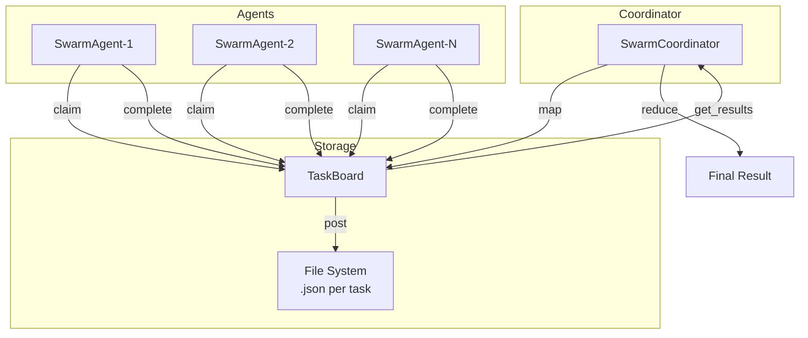

# Design: swarm-intelligence

## Overview

File-based decentralized swarm coordination. TaskBoard uses flock for atomic operations. Coordinator implements map/reduce pattern. Agents claim tasks based on capabilities.

## Architecture



## Components

### Task (task.py)
**Purpose**: Immutable data structure for work items
**Responsibilities**:
- Store task metadata (id, type, description, priority)
- Track lifecycle state (status enum)
- Serialize/deserialize to JSON

### TaskBoard (task_board.py)
**Purpose**: Shared task storage with atomic operations
**Responsibilities**:
- Post tasks to file storage
- Atomic claim with flock
- Query pending/by-type/by-parent

### ReductionStrategy (reduction.py)
**Purpose**: Pluggable result merging
**Responsibilities**:
- FirstResultStrategy: return first
- BestScoreStrategy: max by key
- MergeAllStrategy: combine lists
- MajorityVoteStrategy: count votes

### SwarmAgent (swarm_agent.py)
**Purpose**: Worker that executes tasks
**Responsibilities**:
- Claim tasks matching capabilities
- Execute via registered handlers
- Report complete/fail

### SwarmCoordinator (swarm_coordinator.py)
**Purpose**: MapReduce orchestration
**Responsibilities**:
- map(): create subtasks with parent_id
- reduce(): aggregate by parent_id + strategy
- get_progress(): monitor job state

## Data Flow

1. Coordinator.map(type, desc, payloads) -> parent_id
2. TaskBoard.post(subtask_i) for each payload
3. Agent.claim_next_task() -> task (atomic flock)
4. Agent.execute_task(task) -> result
5. Agent.complete_task(task, result)
6. Repeat 3-5 until all complete
7. Coordinator.reduce(parent_id, strategy) -> final

## Technical Decisions

| Decision | Options | Choice | Rationale |
|----------|---------|--------|-----------|
| Storage | SQLite, Redis, Files | Files | Simplest, no deps, portable |
| Locking | threading.Lock, flock | flock | Cross-process safe |
| Serialization | pickle, JSON, msgpack | JSON | Human-readable, debuggable |
| Async | sync, asyncio | asyncio | Future P2P compatibility |

## File Structure

| File | Action | Purpose |
|------|--------|---------|
| systems/swarm/__init__.py | Create | Package init |
| systems/swarm/task.py | Create | Task dataclass |
| systems/swarm/task_board.py | Create | Shared storage |
| systems/swarm/reduction.py | Create | Merge strategies |
| systems/swarm/swarm_agent.py | Create | Worker agent |
| systems/swarm/swarm_coordinator.py | Create | MapReduce orchestrator |
| systems/swarm/README.md | Create | Documentation |
| tests/swarm/__init__.py | Create | Test package |
| tests/swarm/test_task.py | Create | Task tests (4) |
| tests/swarm/test_task_board.py | Create | TaskBoard tests (7) |
| tests/swarm/test_reduction.py | Create | Reduction tests (6) |
| tests/swarm/test_swarm_agent.py | Create | Agent tests (6) |
| tests/swarm/test_swarm_coordinator.py | Create | Coordinator tests (4) |
| tests/swarm/test_swarm_integration.py | Create | E2E tests (5) |

## Error Handling

| Error | Handling | User Impact |
|-------|----------|-------------|
| Task not found | Return None | Agent retries |
| Claim race | Return False | Agent tries next task |
| Execution error | fail_task() | Logged, task marked FAILED |
| No results | reduce returns None | Coordinator handles |

## Task Lifecycle State Machine

```
PENDING --claim()--> CLAIMED --start()--> IN_PROGRESS
    |                    |                     |
    |                    |--fail()--> FAILED   |
    |                                          |
    |                    <--complete()-- COMPLETED
    |
    --cancel()--> CANCELLED
```

## Existing Patterns to Follow
- File locking pattern: `.geometry/` directories use flock
- Dataclass pattern: `systems/evolution_daemon/` modules
- Strategy pattern: `systems/evolution_daemon/value_evaluator.py`
