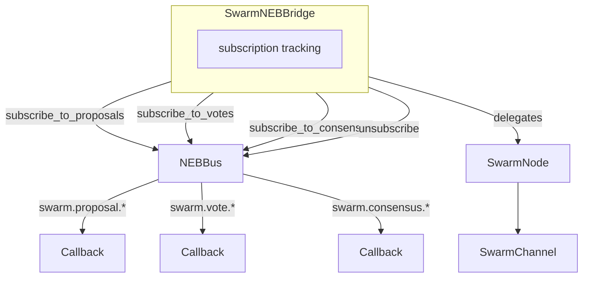

# Design: SwarmNEBBridge Completion

## Overview

Add 4 subscription methods to SwarmNEBBridge that wrap NEBBus.subscribe with wildcard patterns. Follow SwarmAgent.subscribe_to_events pattern.

## Architecture



## Components

### SwarmNEBBridge (Extended)

**Purpose**: Bridge between SwarmNode consensus and NEBBus pub/sub

**New Methods**:

| Method | Pattern | Returns |
|--------|---------|---------|
| subscribe_to_proposals(callback) | `swarm.proposal.*` | subscription_id: str |
| subscribe_to_votes(callback) | `swarm.vote.*` | subscription_id: str |
| subscribe_to_consensus(callback) | `swarm.consensus.*` | subscription_id: str |
| unsubscribe(subscription_id) | - | bool |

**Existing Attributes Used**:
- `_event_bus: Optional[NEBBus]` - already exists

## Data Flow

1. Agent calls `bridge.subscribe_to_proposals(callback)`
2. Bridge delegates to `self._event_bus.subscribe("swarm.proposal.*", callback)`
3. NEBBus returns subscription_id
4. Bridge returns subscription_id to agent
5. When proposal created, bridge.publish triggers NEBBus.match_and_deliver
6. NEBBus calls registered callback with NEBSignal

## Technical Decisions

| Decision | Options | Choice | Rationale |
|----------|---------|--------|-----------|
| Error for missing bus | Return None, raise ValueError, raise RuntimeError | RuntimeError | Matches Python convention for invalid state |
| Unsubscribe without bus | Raise error, return False | Return False | Non-destructive, simpler API |
| Pattern scope | Single proposal (`swarm.proposal.{id}`) or wildcard (`swarm.proposal.*`) | Wildcard | Agents want all proposals, not specific ones |

## File Structure

| File | Action | Purpose |
|------|--------|---------|
| `systems/swarm/swarm_neb_bridge.py` | Modify | Add 4 subscription methods |
| `systems/swarm/__init__.py` | Modify | Export SwarmNEBBridge |
| `tests/swarm/test_swarm_neb_bridge.py` | Create | 7 tests (4 unit + 3 integration) |

## Error Handling

| Error | Handling | User Impact |
|-------|----------|-------------|
| No event_bus on subscribe | Raise RuntimeError | Clear error message |
| No event_bus on unsubscribe | Return False | Silent failure, safe |
| Invalid subscription_id | NEBBus returns False | Propagated to caller |

## Existing Patterns to Follow

- `SwarmAgent.subscribe_to_events(bus)` in `systems/swarm/swarm_agent.py:142-145`
- `TaskBoard.__init__(event_bus=...)` for optional event_bus pattern
- Test pattern in `tests/swarm/test_swarm_agent_neb.py` for tmp_path fixture usage

## Method Implementations

```python
def subscribe_to_proposals(self, callback) -> str:
    """Subscribe to all proposal events."""
    if self._event_bus is None:
        raise RuntimeError("Cannot subscribe without event_bus")
    return self._event_bus.subscribe("swarm.proposal.*", callback)

def subscribe_to_votes(self, callback) -> str:
    """Subscribe to all vote events."""
    if self._event_bus is None:
        raise RuntimeError("Cannot subscribe without event_bus")
    return self._event_bus.subscribe("swarm.vote.*", callback)

def subscribe_to_consensus(self, callback) -> str:
    """Subscribe to all consensus events."""
    if self._event_bus is None:
        raise RuntimeError("Cannot subscribe without event_bus")
    return self._event_bus.subscribe("swarm.consensus.*", callback)

def unsubscribe(self, subscription_id: str) -> bool:
    """Unsubscribe from events."""
    if self._event_bus is None:
        return False
    return self._event_bus.unsubscribe(subscription_id)
```
