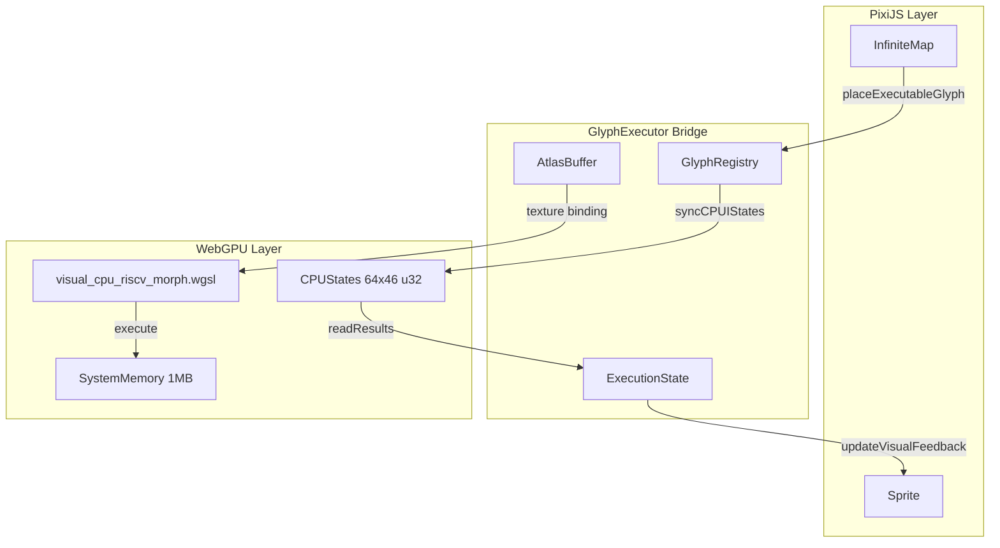

# Design: The Motherboard

## Overview

Three-layer architecture: PixiJS (visual) -> GlyphExecutor (bridge) -> WebGPU (compute). GlyphExecutor manages state synchronization between visual sprites and GPU buffers.

## Architecture



## Components

### GlyphExecutor

**Purpose**: Bridge visual glyphs to GPU execution

**Responsibilities**:
- Initialize WebGPU device and buffers
- Load glyph atlas texture
- Register/unregister glyphs with core assignment
- Dispatch compute shader per execution cycle
- Read back CPU states and update visuals

**State**:
```javascript
{
    device: GPUDevice,
    systemMemory: GPUBuffer,  // 1MB storage
    cpuStates: GPUBuffer,     // 64 cores * 46 regs * 4 bytes
    atlasTexture: GPUTexture,
    glyphRegistry: Map<string, GlyphEntry>,
    ticker: number | null,    // Auto-execution interval
    initialized: boolean
}
```

### GlyphEntry

**Purpose**: Track per-glyph execution state

```typescript
interface GlyphEntry {
    sprite: PIXI.Sprite;
    atlasX: number;
    atlasY: number;
    coreId: number;
    pc: number;
    active: boolean;
    lastResult: { cycles: number, fraud?: boolean } | null;
    executionCount: number;
    glowIntensity: number;
}
```

### InfiniteMap Extension

**Purpose**: Integrate GlyphExecutor with existing map

**New Methods**:
- `placeExecutableGlyph(mapX, mapY, glyphCode)` - Place and register glyph
- `executeGlyphs()` - Trigger single execution cycle
- `createGlyphSprite(glyphCode, mapX, mapY)` - Create visual sprite

## Data Flow

1. **Placement**: User clicks map -> `placeExecutableGlyph(x, y, code)` -> create sprite -> register with executor
2. **Execution Start**: `executeGlyphs()` -> `syncCPUIStates()` -> write PC values to buffer
3. **Compute**: Dispatch shader -> decode holographic -> verify symmetry -> execute RISC-V
4. **Results**: `readResults()` -> copy buffer -> map to read -> update registry
5. **Visual**: `updateVisualFeedback()` -> update sprite alpha/scale/tint

## Technical Decisions

| Decision | Options | Choice | Rationale |
|----------|---------|--------|-----------|
| Core assignment | Round-robin, spatial hash | Round-robin modulo | Simple, deterministic |
| Execution timing | rAF, setInterval | setInterval | Decouple from render loop |
| Visual feedback | Custom filter, sprite props | Sprite props | No shader changes needed |
| Buffer readback | Map-read, staging buffer | Map-read staging | Standard WebGPU pattern |
| Atlas loading | Fetch+ImageBitmap, base64 | Fetch+ImageBitmap | Efficient for large atlases |

## File Structure

| File | Action | Purpose |
|------|--------|---------|
| `web/GlyphExecutor.js` | Create | Core bridge class |
| `web/infinite_map.js` | Modify | Add integration methods |
| `web/test_motherboard.html` | Create | Test page with UI |
| `web/tests/test_glyph_executor.js` | Create | Unit tests |
| `docs/motherboard.md` | Create | Usage documentation |

## Error Handling

| Error | Handling | User Impact |
|-------|----------|-------------|
| WebGPU unavailable | Console warning, disable execution | Manual placement still works |
| Atlas load failure | Throw from init(), catch in InfiniteMap | GlyphExecutor stays uninitialized |
| Compute shader error | GPU error scope, log to console | Execution stops, glyphs inactive |
| Buffer readback fail | Try/catch, mark glyphs inactive | Visual feedback shows halted |

## WebGPU Bind Group Layout

```javascript
const bindGroupLayout = device.createBindGroupLayout({
    entries: [
        { binding: 0, visibility: GPUShaderStage.COMPUTE, texture: { sampleType: 'float' } },
        { binding: 1, visibility: GPUShaderStage.COMPUTE, buffer: { type: 'storage' } },
        { binding: 2, visibility: GPUShaderStage.COMPUTE, buffer: { type: 'storage' } },
    ]
});
```

## Existing Patterns to Follow

| Pattern | Source | Application |
|---------|--------|-------------|
| Class constructor with options spread | `infinite_map.js:18-31` | GlyphExecutor options pattern |
| Async init with error handling | `infinite_map.js:82-90` | WebGPU init pattern |
| Console emoji logging | Throughout codebase | Consistent logging style |
| Event mode 'static' for interaction | PixiJS v8 pattern | Sprite interaction |
