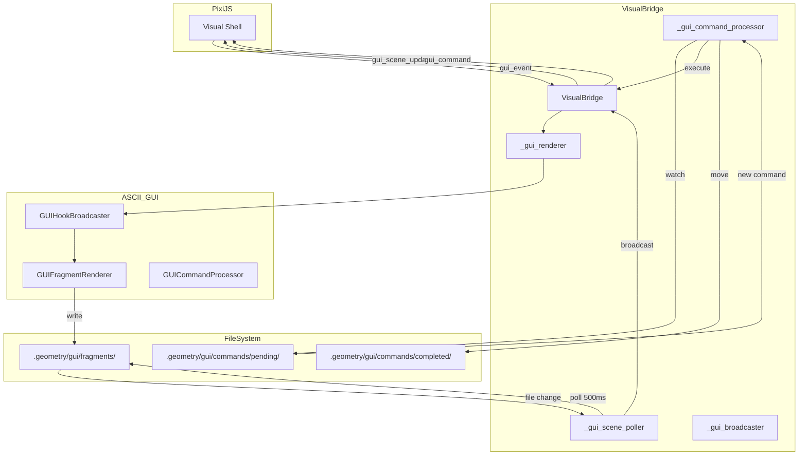

# Design: Visual Bridge GUI Integration

## Overview

Extend VisualBridge with GUI-specific state, poller, command processor, and WebSocket handlers. Mirror the ASCII Scene Graph integration pattern for consistency.

## Architecture

## Components

### GUI State Variables (VisualBridge.__init__)

**Purpose**: Track GUI-specific state alongside ASCII state
**Variables**:
- `gui_scene_dir: Path` - `.geometry/gui/fragments/`
- `gui_scene_files: Dict[str, str]` - filename -> content cache
- `_gui_renderers_registered: bool` - guard flag
- `_gui_command_processor: Optional[Any]` - processor instance
- `_gui_broadcaster: Optional[GUIHookBroadcaster]` - event dispatcher
- `_gui_renderer: Optional[GUIFragmentRenderer]` - fragment generator

### GUI Scene Poller

**Purpose**: Monitor GUI fragment directory and broadcast changes
**Implementation**:
- Async loop with 500ms sleep
- Glob all files (not just `*.ascii`, includes `*.yaml`)
- Compare content hash, broadcast on change
- Handle errors gracefully, back off 5s on failure

### GUI Command Processor

**Purpose**: Process AI-initiated GUI commands
**Implementation**:
- Use `GUICommandProcessor` from `ascii_gui` module
- Inject `_execute_gui_command` callback
- Broadcast command execution to clients
- Handle `focus`, `close` actions via broadcaster

### WebSocket Message Handlers

**Purpose**: Bi-directional GUI state sync
**Handlers**:
- `gui_scene_request` -> `broadcast_gui_scene_list()`
- `gui_scene_update` -> write file, broadcast
- `gui_event` -> route to broadcaster methods

## Data Flow

1. **PixiJS creates window** -> sends `gui_event` with `window_create`
2. **VisualBridge** -> calls `_gui_broadcaster.on_window_create()`
3. **GUIFragmentRenderer** -> writes `windows.yaml` to `.geometry/gui/fragments/`
4. **GUI Scene Poller** -> detects change, broadcasts `gui_scene_update`
5. **AI Agent** -> reads `windows.yaml`, decides to focus window
6. **AI Agent** -> writes command to `.geometry/gui/commands/pending/`
7. **GUI Command Processor** -> validates, executes via `_execute_gui_command`
8. **VisualBridge** -> broadcasts `gui_command`, calls broadcaster
9. **PixiJS** -> receives `gui_command`, executes focus action

## Technical Decisions

| Decision | Options | Choice | Rationale |
|----------|---------|--------|-----------|
| Poll interval | 100ms, 500ms, 1000ms | 500ms | Faster than ASCII (1s) for UI responsiveness |
| File pattern | `*.ascii` only, all files | All files | GUI includes `.yaml` config files |
| Command executor | Inline, callback injection | Callback injection | Allows testing with mock executor |
| Error handling | Crash, log-and-continue | Log-and-continue | Follows ASCII poller pattern |

## File Structure

| File | Action | Purpose |
|------|--------|---------|
| `systems/visual_shell/api/visual_bridge.py` | Modify | Add GUI integration |
| `tests/systems/visual_shell/api/test_visual_bridge_gui.py` | Create | Integration tests |
| `docs/gui-visual-bridge-integration.md` | Create | User documentation |

## Error Handling

| Error | Handling | User Impact |
|-------|----------|-------------|
| GUI module import fails | Log warning, skip registration | GUI features disabled |
| Fragment dir missing | Create on registration | Auto-heal |
| Command validation fails | Move to completed with error | AI sees rejection reason |
| Poller exception | Log, sleep 5s, continue | Temporary degradation |

## Existing Patterns to Follow

- `_ascii_scene_poller()` at `visual_bridge.py:1582-1610` - copy structure for `_gui_scene_poller()`
- `register_ascii_renderers()` at `visual_bridge.py:1546-1569` - copy structure for `register_gui_renderers()`
- `ascii_scene_update` handler at `visual_bridge.py:996-1007` - copy for `gui_scene_update`
