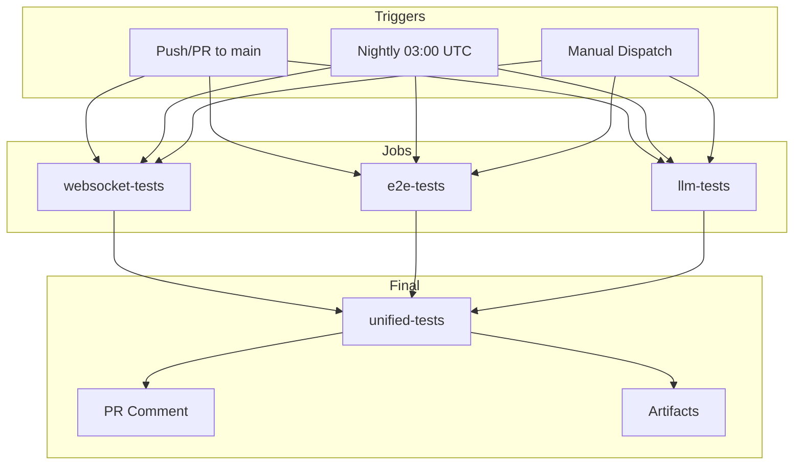

# Design: Web Terminal CI/CD Integration

## Overview

Add GitHub Actions workflow for 4 terminal test suites with parallel execution, mock modes, and artifact collection. Follow `integration-tests.yml` pattern.

## Architecture

## Components

### CI Test Runner Script (`ci_terminal_tests.sh`)

**Purpose**: Unified bash script for CI environment
**Responsibilities**:
- Run WebSocket tests via pytest
- Run E2E tests via Node/Puppeteer
- Run LLM tests in mock mode
- Skip ASCII tests with message
- Return proper exit codes
- Output summary table

### GitHub Actions Workflow (`terminal-tests.yml`)

**Purpose**: Define CI pipeline
**Responsibilities**:
- Trigger on push/PR/schedule/manual
- Run 4 parallel jobs (websocket, e2e, llm, unified)
- Upload artifacts
- Comment on PRs
- Generate summary report

### LLM Mock Mode

**Purpose**: Enable LLM tests in CI without LM Studio
**Responsibilities**:
- Check `TERMINAL_TEST_MOCK_LLM` env var
- Return mock JSON responses
- Skip LM Studio API calls
- Verify imports work

## Data Flow

1. Developer pushes code to `systems/visual_shell/api/**`
2. GitHub triggers `terminal-tests.yml` workflow
3. Parallel jobs start: websocket, e2e, llm
4. Each job installs deps and runs tests
5. Artifacts uploaded (XML, screenshots)
6. Unified job aggregates results
7. PR comment posted with summary table
8. CI badge updates

## Technical Decisions

| Decision | Options | Choice | Rationale |
|----------|---------|--------|-----------|
| Workflow file | New vs modify existing | New | Separation of concerns |
| E2E browser | Selenium vs Puppeteer | Puppeteer | Already used in e2e_terminal_test.js |
| LLM mode | Real vs Mock | Mock | No LM Studio in CI |
| ASCII tests | Skip vs Mock | Skip | X11 impossible in CI |
| Job parallelism | Serial vs Parallel | Parallel | Faster CI |

## File Structure

| File | Action | Purpose |
|------|--------|---------|
| `systems/visual_shell/api/tests/ci_terminal_tests.sh` | Create | Unified CI runner |
| `.github/workflows/terminal-tests.yml` | Create | Workflow definition |
| `systems/visual_shell/api/tests/llm_terminal_verify.py` | Modify | Add mock mode |
| `docs/ci-secrets.md` | Create | Secret documentation |
| `wordpress_zone/.../README.md` | Modify | Add CI badge |

## Error Handling

| Error | Handling | User Impact |
|-------|----------|-------------|
| Visual Bridge down | Tests skip gracefully | No CI failure |
| Puppeteer fails | continue-on-error: true | Logged, non-blocking |
| LLM mock fails | Exit 0 with warning | Clear message in logs |
| Missing WP_ADMIN_PASS | E2E tests skip | Documented in secrets doc |

## Existing Patterns to Follow

- `.github/workflows/integration-tests.yml`: Job structure, artifact upload, PR comments
- `test_terminal_bridge.py`: `requires_visual_bridge` skip decorator
- `llm_terminal_verify.py`: Async pattern with aiohttp
