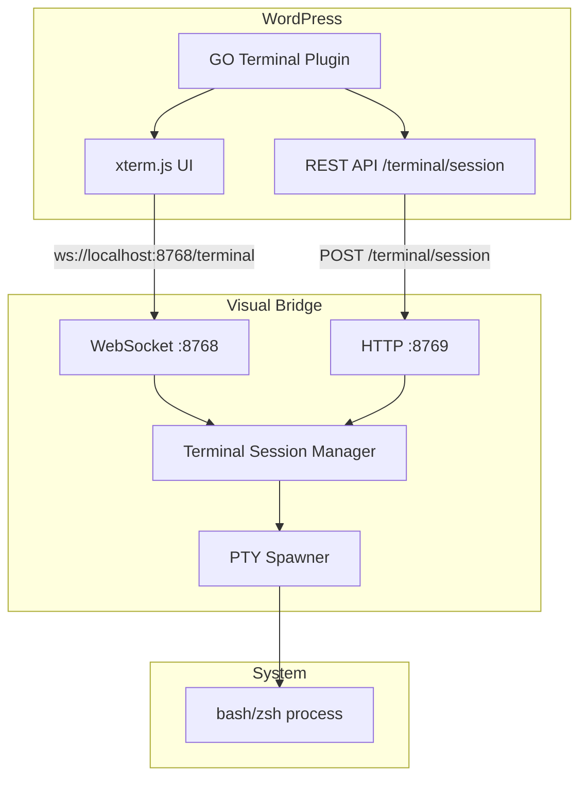

# Design: WordPress Web Terminal

## Overview

Three-tier architecture: WordPress plugin (xterm.js UI) -> Visual Bridge (WebSocket + PTY) -> Shell process. Plugin extends existing Visual Bridge with terminal handlers using established patterns from ASCII Desktop Control.

## Architecture

## Components

### Component A: GeometryOS_WebTerminal (WordPress Plugin)

**Purpose**: Admin UI and session management
**Responsibilities**:
- Register admin menu page
- Enqueue xterm.js assets from CDN
- Generate session tokens
- Provide REST endpoints for session creation

**File**: `wordpress_zone/wordpress/wp-content/plugins/geometry-os-web-terminal/geometry-os-web-terminal.php`

### Component B: Terminal UI (JavaScript)

**Purpose**: xterm.js terminal emulator
**Responsibilities**:
- Initialize Terminal with Geometry OS theme
- Connect WebSocket to Visual Bridge
- Handle input/output streaming
- Manage resize events
- Display connection status

**File**: `wordpress_zone/wordpress/wp-content/plugins/geometry-os-web-terminal/assets/js/terminal.js`

### Component C: Visual Bridge Terminal Handlers

**Purpose**: Extend Visual Bridge for terminal support
**Responsibilities**:
- Handle `input` and `resize` WebSocket messages
- Spawn PTY processes using Python stdlib
- Broadcast PTY output to WebSocket clients
- Clean up sessions on disconnect

**File**: `systems/visual_shell/api/visual_bridge.py` (modify existing)

## Data Flow

1. Admin clicks "GO Terminal" -> WordPress renders page with xterm.js container
2. JavaScript initializes Terminal, generates session token
3. WebSocket connects to `ws://localhost:8768/terminal?token=<token>`
4. Visual Bridge validates token, spawns PTY process
5. User types -> `input` message -> PTY stdin
6. PTY stdout -> `output` message -> Terminal display
7. Window resize -> `resize` message -> PTY winsize update
8. Tab close -> WebSocket close -> PTY cleanup

## Technical Decisions

| Decision | Options | Choice | Rationale |
|----------|---------|--------|-----------|
| PTY Implementation | Rust API / Python stdlib | Python stdlib | Simpler, no external dependency, sufficient for single sessions |
| xterm.js Source | Bundle / CDN | CDN | Easier updates, smaller plugin size |
| Session Token | JWT / WordPress nonce hash | WordPress nonce hash | Consistent with WP auth patterns |
| WebSocket Path | Generic / Dedicated | `/terminal` path | Separates terminal from other Visual Bridge traffic |

## File Structure

| File | Action | Purpose |
|------|--------|---------|
| `wordpress_zone/.../geometry-os-web-terminal/geometry-os-web-terminal.php` | Create | Main plugin class |
| `wordpress_zone/.../geometry-os-web-terminal/assets/css/terminal.css` | Create | Geometry OS terminal theme |
| `wordpress_zone/.../geometry-os-web-terminal/assets/js/terminal.js` | Create | xterm.js initialization and WebSocket |
| `systems/visual_shell/api/visual_bridge.py` | Modify | Add terminal handlers |
| `systems/visual_shell/api/tests/test_terminal_bridge.py` | Create | Integration tests |

## Error Handling

| Error | Handling | User Impact |
|-------|----------|-------------|
| Visual Bridge not running | Display warning, disable terminal | "Visual Bridge not running on port 8768" |
| WebSocket connection failed | Auto-reconnect with 3s delay | "Connection lost, reconnecting..." |
| PTY spawn failure | Return error message | "Failed to spawn shell process" |
| Session token invalid | Reject WebSocket connection | Connection closes immediately |

## Security Considerations

| Concern | Mitigation |
|---------|------------|
| Unauthorized access | `manage_options` capability check |
| Session hijacking | Token bound to user ID + WordPress nonce |
| PTY escape | Processes run as web server user (limited scope) |
| WebSocket CORS | `localhost` only (same-origin) |

## Existing Patterns to Follow

- **Plugin structure**: Follow `ASCII_Desktop_Control` class pattern with constructor hooks, include loading, AJAX handlers
- **Visual Bridge handlers**: Add to existing `handle_client()` message type switch (lines 278-840)
- **HTTP endpoints**: Use existing aiohttp app in `visual_bridge.py` (lines 111-146)
- **Session management**: Similar to agent task queue pattern (lines 148-192)
