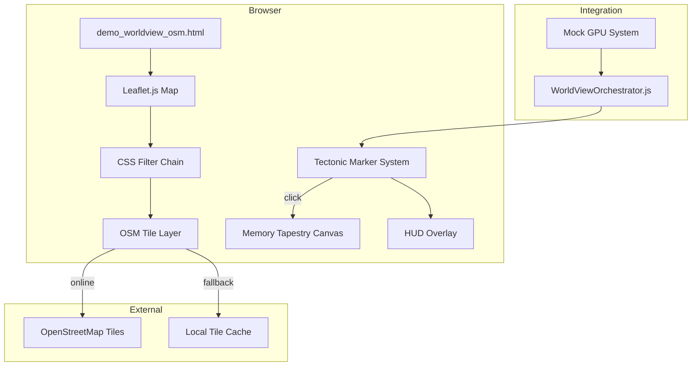

# Design: worldview-osm

## Overview

Single-page HTML application using Leaflet.js for map rendering, CSS filters for aesthetic transformation, and integration with existing WorldViewOrchestrator API. Optional Python script for offline tile caching.

## Architecture



## Components

### Component A: Leaflet Map Container

**Purpose**: Initialize and manage the OpenStreetMap tile layer with green phosphor aesthetic.

**Responsibilities**:
- Initialize Leaflet map centered on Texas State Capitol (30.2747, -97.7403)
- Apply CSS filter chain for green phosphor effect
- Handle tile source selection (local vs online)
- Track mouse coordinates for HUD display

**CSS Filter Chain**:
```css
filter:
  sepia(100%)      /* Convert to monochrome brown */
  hue-rotate(70deg) /* Shift to green */
  saturate(300%)    /* Boost color intensity */
  brightness(0.7)   /* Darken for CRT feel */
  contrast(1.2);    /* Sharpen edges */
```

### Component B: Tectonic Node Marker System

**Purpose**: Display running kernels as interactive map markers with load-based pulse animation.

**Responsibilities**:
- Create Leaflet divIcon markers with custom HTML
- Animate pulse ring based on kernel load (faster pulse = higher load)
- Handle click events to trigger Memory Tapestry
- Update HUD with kernel count and average load

**Marker HTML Structure**:
```html
<div class="tectonic-marker-container">
  <div class="tectonic-marker"></div>
  <div class="tectonic-marker-pulse"></div>
  <div class="tectonic-label">{name}</div>
</div>
```

### Component C: Memory Tapestry Overlay

**Purpose**: Full-screen overlay rendering kernel memory as color visualization.

**Responsibilities**:
- Show/hide overlay on marker click
- Render 512x512 canvas from Uint32Array memory buffer
- Map memory values to RGBA pixels with green tint
- Display kernel name in title

**Memory-to-Pixel Mapping**:
```
u32 val = buffer[i]
R = val & 0xFF
G = (val >> 8) & 0xFF || 128  // Green tint default
B = (val >> 16) & 0xFF
A = 255
```

### Component D: HUD Overlay

**Purpose**: Display system metrics and kernel status in terminal aesthetic.

**Elements**:
- Title: `TECTONIC WORLDVIEW [OSM]`
- Substrate indicator: `OPENSTREETMAP`
- Kernel count
- Total load percentage
- Coordinate tracker
- Per-kernel load list

### Component E: Offline Tile Cache

**Purpose**: Python script to download and cache tiles for offline operation.

**Coverage**:
- Zoom 0-4: Full world
- Zoom 5-8: North America

**Storage**: `systems/visual_shell/web/tiles/{z}/{x}/{y}.png`

## Data Flow

1. Page loads, initializes Leaflet map with CSS filter
2. Tile source check: fetch `./tiles/0/0/0.png`, use local if exists else online
3. WorldViewOrchestrator registers kernels via `registerKernel()`
4. Each registration triggers `window.addTectonicNode()` to create marker
5. 10Hz sync loop calls `orchestrator.sync()` to update loads
6. Marker click triggers `orchestrator.zoomInto(id)`
7. Orchestrator fetches memory, calls `window.showMemoryTapestry()`
8. Tapestry renders buffer to canvas, shows overlay

## Technical Decisions

| Decision | Options | Choice | Rationale |
|----------|---------|--------|-----------|
| Map library | Leaflet, MapLibre, OpenLayers | Leaflet | Lightweight, CDN-available, sufficient for needs |
| Aesthetic method | WebGL shader, SVG filter, CSS filter | CSS filter | Simple, performant, no extra dependencies |
| Tile fallback | Service worker, fetch check, hardcoded | fetch check | Simple detection, works without SW registration |
| Memory viz | Hilbert curve, linear scan, Morton order | Linear scan | Matches existing synthetic implementation |

## File Structure

| File | Action | Purpose |
|------|--------|---------|
| `systems/visual_shell/web/demo_worldview_osm.html` | Create | Main OSM WorldView page |
| `systems/visual_shell/web/osm_tile_cache.py` | Create | Tile download script |
| `systems/visual_shell/web/tiles/` | Create | Local tile cache directory |

## Error Handling

| Error | Handling | User Impact |
|-------|----------|-------------|
| Online tiles unavailable | Fallback to cached tiles (if any) | May see missing tiles |
| No cached tiles, offline | Map shows gray background | Clear indicator of offline mode |
| Marker creation fails | Log error, continue | Missing marker, HUD count unaffected |
| Memory read fails | Show empty tapestry | Visual indicator of unavailable memory |

## Existing Patterns to Follow

- **HUD styling**: Match `demo_synthetic_worldview.html` CSS classes (`hud-title`, `status`, `node-item`, `pulse-high`, `pulse-low`)
- **Orchestrator hooks**: Use global `window.addTectonicNode`, `window.updateTectonicNode`, `window.showMemoryTapestry`
- **Mock GPU system**: Copy mock object from synthetic demo
- **Sync interval**: 10Hz (100ms) loop matching existing pattern
